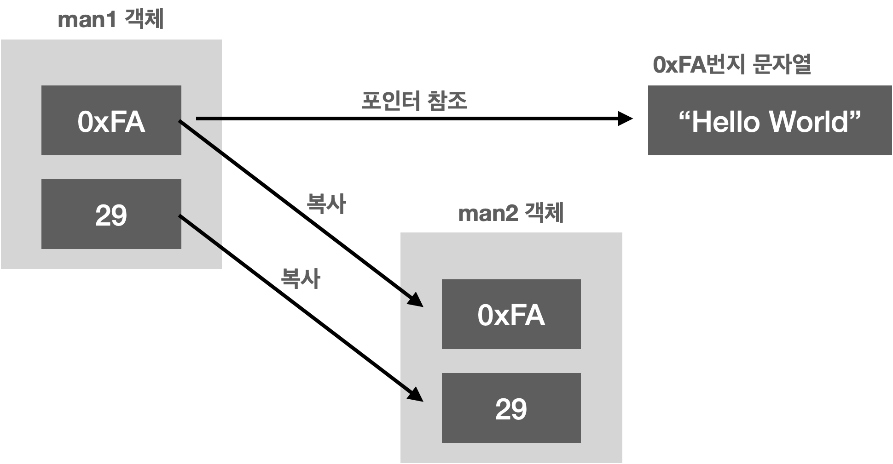
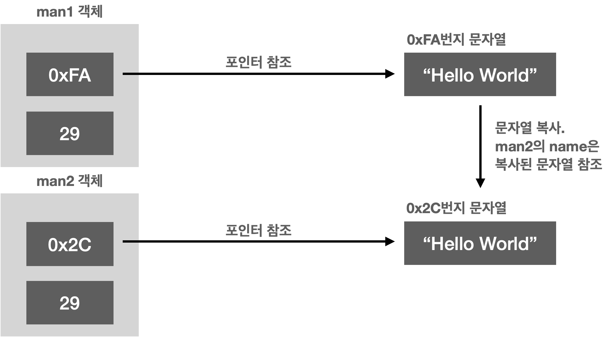

 # C++ Study

## 인라인(inline) 함수
프로그램 코드라인 안으로 들어가 버린 함수 라는 뜻
- 매크로 함수
  - ex] #define SQUARE(X) ((X)*(X))
- 인라인 함수
  - **inline** 키워드를 사용한 함수

매크로를 사용한 인라인화는 전처리기에 의해서 처리되지만 키워드 inline을 이용한 함수의 인라인화는 컴파일러에 의해서 처리됨. 컴파일러는 함수의 인라인화가 오히려 성능에 해가 된다고 판단할 경우, 이 키워드를 무시해버리기도 함

## 참조자(Reference)의 이해
변수란? : 변수는 할당된 메모리 공간에 붙여진 이름, 그 이름을 통해 해당 메모리 공간에 접근하는 것이 가능

이미 선언된 변수의 앞에 **&** 를 붙이면 이것은 참조자를 의미 
ex] int &num2=num1  
참조자는 자신이 참조하는 변수를 대신할 수 있는 또 하나의 이름

## 클래스 기본
구조체 안에 함수가 정의되어 있을 시 함수를 인라인으로 처리함 But, 함수를 구조체 밖으로 빼내면 인라인 처리를 하지 않음.

## 클래스 vs 구조체
c++에서 클래스와 구조체의 차이는 각각의 변수 및 함수의 접근 허용 범위를 클래스는 별도로 선언해야 한다는 차이

## const 함수
함수 내에서 멤버변수에 저장된 값을 변경하지 않겠다는 의미의 함수, 따라서 const 선언이 추가된 멤버함수 내에서 멤버변수의 값을 변경하는 코드가 삽입되면 컴파일 에러가 발생함 
ex] int GetX() const;  
const 함수 내에서는 const가 아닌 함수의 호출은 제한됨

## 멤버 이니셜라이져(Member Initializer)를 이용한 초기화
Ex] Rectangle:Rectangle(const int &x1, const int &y1, const int &x2, const int &y2): upLeft(x1, y1), lowRight(x2, y2) { }  
**: upLeft(x1, y1), lowRight(x2, y2)**가 멤버 이니셜라이져 
*객체 upLeft, lowRight의 생성과정에서 x1과 y1을 인자로 전달받는 생성자를 호출하라*라는 의미

## 객체 배열
객체 기반의 배열 예제 
ex]   
SoSimple arr[10];  
SoSimple* ptrArr = new SoSimple[10];  
(SoSimple은 클래스 이름)  

배열을 선언하는 경우에도 객체의 생성자는 호출이 된다 단, 배열의 선언과정에서는 호출할 생성자를 별도 명시는 하지 못함(생성자에 인자를 전달하지 못하기 때문) 즉, 위의  형태로 배열을 생성하기 위해선 아래의 생성자가 반드시 필요하다  
SoSimple() { }  
배열선언 이후에 각각의 요소를 원하는 값으로 초기화를 원한다면 일일이 초기화의 과정을 별도로 거쳐야 함

## Self-Reference의 반환
Self-Reference란 객체 자신을 참조할 수 있는 참조자를 의미
(Project: Cplusplus_Study/4-5.SelfReference)

## 복사 생성자
### explicit
'SoSimple sim2 = sim1' 은 'SoSimple sim2(sim1)'로 묵시적 변환이 된다. 하지만 이러한 묵시적 변환이 싫은경우 이를 막기 위해 explicit 키워드를 사용해 막을 수 있다.
복사 생성자 지정시 **explicit** 키워드를 사용하면 된다. 
explicit SoSimple(constt SoSimple &copy) : num1(copy.num1), num2(copy.num2) {  }
### 깊은 복사와 얕은 복사
디폴트 복사 생성자는 멤버 대 멤버의 복사를 진행함. 그리고 이러한 방식의 복사를 가리켜 **얕은 복사(shallow copy)**라 함. 하지만 이는 멤버변수가 힙의 메모리 공간을 참조하는 경우에 문제가 발생하게 됨(Project : Cplusplus_Study/5-2.ShallowCopyError) 

 
깊은 복사(deep copy)를 하면 멤버 뿐만 아니라 포인터로 참조하는 대상까지 깊게 복사하는 것을 깊은 복사라고 함(Project : Cplusplus_Study/5-3.DeepCopy)

### 복사 생성자 호출 시점
1. 기존에 생성된 객체를 이용해 새로운 객체를 초기화 하는 경우
2. Call-by-value 방식의 함수 호출 과정에서 객체를 인자로 전달하는 경우
3. 객체를 반환하되, 참조형으로 반환하지 않는 경우
 위의 3가지 경우 공통점은 객체를 새로 생성함과 동시에 동일한 자료형의 객체로 초기화해야 함을 알 수 있음

### 임시객체
객체를 반환하게 되면 **임시객체**라는 것이 생성됨.  
- 임시객체의 소멸시기
  - 임시객체는 다음 행으로 넘어가면 바로 소멸되어 버림
  - 참조자에 참조되는 임시객체는 바로 소멸되지 않음
