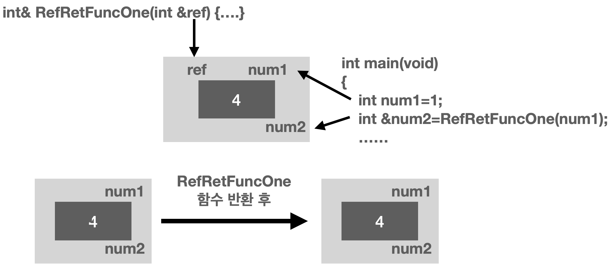
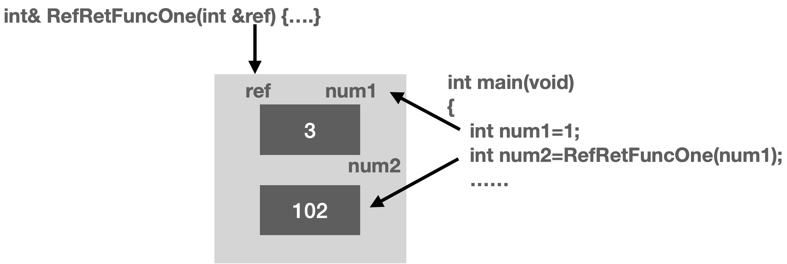

# 참조자(Reference)

## 반환형이 참조형(Reference Type)인 경우
1. 함수의 반환형에 참조형이고 참조형으로 반환형을 받은 경우  
(Projects: 1.RefReturn)  
  
참조자 ref는 지역변수와 동일한 성격을 지닌다. 즉, RefRetFuncOne이 반환을 하면, 참조자 ref는 소멸된다. 그러나 참조자는 참조자일뿐, 그 자체로 변수는 아니기 때문에 참조자가 참조하는 변수는 소멸되지 않는다.

2. 함수의 반환형이 참조형이지만 기본자료형으로 반환형을 받은 경우  
(Projects: 2.RefReturn)  
  

3. 함수의 반환형이 참조형이 아닌 기본자료형인 경우
(Projects: 3.RefReturn)  
3.RefReturn Project의 결과는 2.RefReturn의 결과와 차이가 없다 그러나 반환형이 참조형인 2.RefReturn는 두가지 형태로 저장 할 수 있다  
int num2 = RefRetFuncOne(num1)  
int &num2 = RefRetFuncOne(num1)  
하지만 반환형이 기본형인 3.RefReturn의 프로젝트는 반드시 기본자료형 변수에만 저장해야 한다.