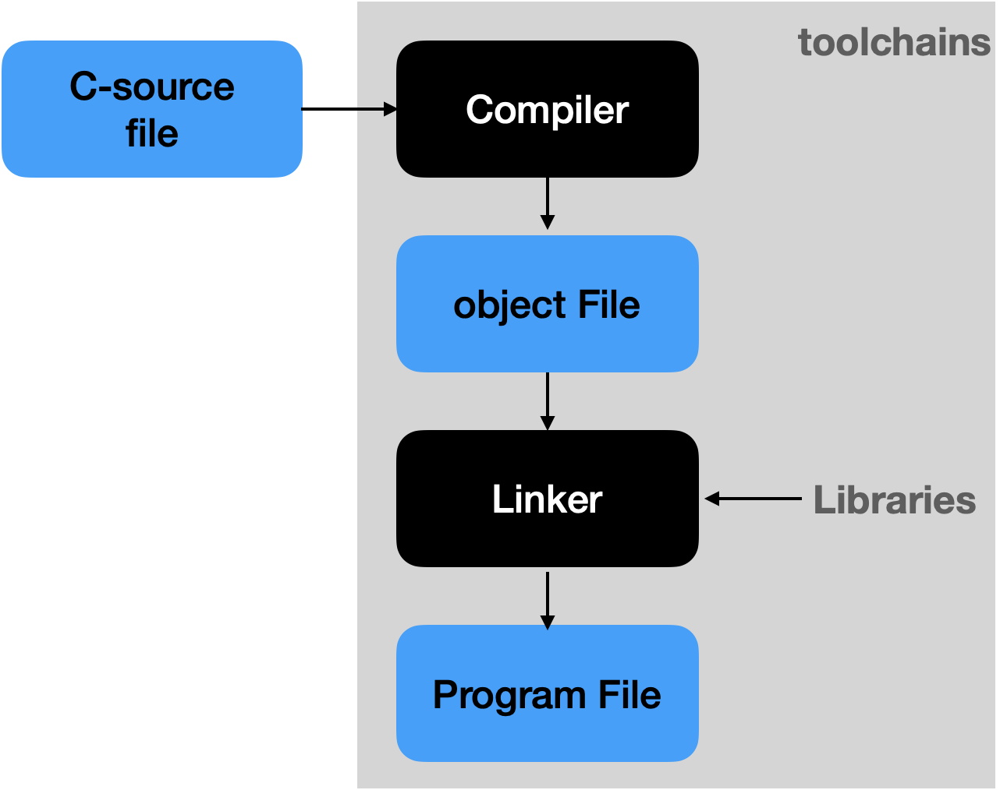

# GCC vs Clang/LLVM
GCC: GNU Compiler Collection  
Clang LLVM: LLVM(Low Level Virtual Machine) 
Clang is mainly used to provide performance superior to that GCC

## 3 mainstream c/c++ compilers in the industry
- Visual C++
- GNU Compiler Collection(GCC)
- Clang/Low Level Virtual Machine(LLVM)

## Visual C++
Visual C++ provides GUI and easy to debug. but it is not suitable for Linux Platform

## GCC
GCC is a program language compiler developed by GNU and a main compiler for compiling and creating other UNIX operating system

## LLVM
LLVM contains a series of modularized compiler components & toolchains 
and LLVM can optimize program languages and links during compilation, runtime

## Clang
Clang is C, C++, Objective-C, Objective-C++ compiler that is compiled in C++ based on LLVM

## Reference
### 1. toolchains
Set of necessary development tools for build computer program 
The development tools included here are works chainly 
